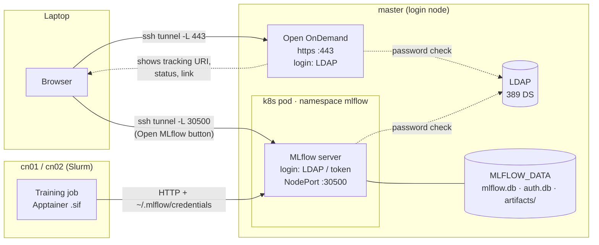
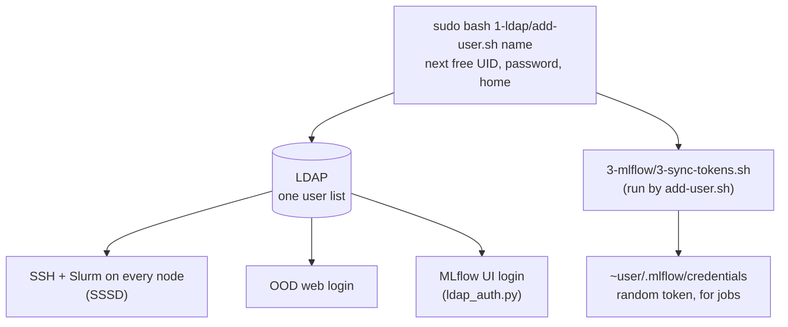
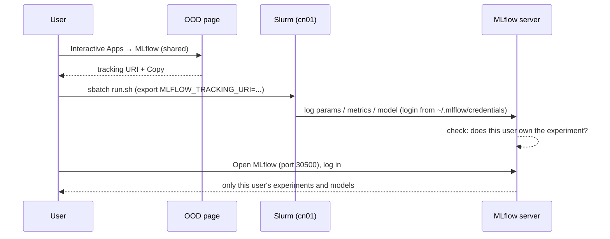
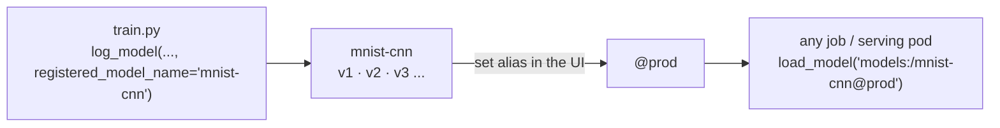

# MLflow workflow

How the shared MLflow with login fits together: who talks to what, how a user gets access, and how a model goes from a training job into the registry. For the setup steps, see [README.md](README.md).

## 1. The big picture



- **OOD** is the front door. Its **MLflow (shared)** page shows the server status and the tracking URI, and has an **Open MLflow** button.
- **Open MLflow** goes **straight to port 30500**, not through OOD. OOD's `/node` proxy strips the password, so MLflow would always answer 401.
- **Jobs** talk to MLflow over HTTP. The login comes from `~/.mlflow/credentials`, so there's never a password in the script.
- **All data** lives in one folder on master (mode `700`, owned by the `mlflow` system account). Users reach it only through MLflow, which checks permissions.

## 2. Adding a user (admin)



| Login | Set by | Same password? |
|---|---|---|
| Linux / SSH / Slurm | LDAP (`passwd` or `ldappasswd`) | one password |
| OOD (web) | LDAP | same |
| MLflow UI | LDAP | same |
| MLflow jobs | token in `~/.mlflow/credentials` (`3-sync-tokens.sh`) | a token, not the password |

Every node with `1-ldap/2-client.sh` knows every user with the same UID, so jobs run as them everywhere.

## 3. A training run (user)



The tracking URI (`MLFLOW_URI` in `site.conf`) is fixed and never changes. This cluster:

```bash
export MLFLOW_TRACKING_URI=http://192.168.40.102:30500/node/192.168.40.102/30500
```

## 4. Model registry



1. **Register:** each training run that logs with `registered_model_name` adds a new version.
2. **Promote:** in the UI, put an alias (`@prod`, `@staging`) on the version you trust.
3. **Use:** code always loads `models:/<name>@prod`. Moving the alias switches every consumer, with no path changes.

## 5. Who sees what

The server runs with `default_permission = NO_PERMISSIONS`, so everything is private to its creator.

| | Owner | Other users | MLflow admin |
|---|---|---|---|
| Experiments, runs, metrics | full | nothing (403) | everything |
| Artifacts / model files | download | 403 | everything |
| Registered models | full | nothing, until the owner grants READ / EDIT | everything |
| Files on disk | no direct access (folder is `700`, owned by `mlflow`) | no | root only |

To share on purpose, the owner (or the admin) grants **READ**, **EDIT** or **MANAGE** on the experiment or model in the MLflow UI.

## 6. Where everything lives

| What | Where |
|---|---|
| Runs, metrics, registry | `MLFLOW_DATA/mlflow.db` |
| Users + permissions | `MLFLOW_DATA/auth.db` |
| Artifacts, model files | `MLFLOW_DATA/artifacts/<experiment_id>/` |
| MLflow admin password | `MLFLOW_DATA/admin.pass` |
| Server image | `MLFLOW_IMAGE` (built from `image/`) |
| Pod, Service | `kubectl -n mlflow get pod,svc` |

Back up `mlflow.db`, `auth.db` and `artifacts/` **together**. Losing `mlflow.db` loses every run, version and alias.

`MLFLOW_DATA` is `/home/apps/mlflow-shared` on this cluster.

## 7. Known limits

- **Two SSH tunnels** (443 for OOD, 30500 for the MLflow UI), and two browser logins with the same password. Fix: single sign-on (Keycloak + OIDC in front of OOD and MLflow, on top of this LDAP).
- **One pod with a 2Gi memory limit** serves every artifact upload and download. Keep large weights on the filesystem and store only their path in MLflow, or move artifacts to S3/MinIO.
- **No Clean button** for the trash yet. The admin runs `mlflow gc` in the pod (see README).
